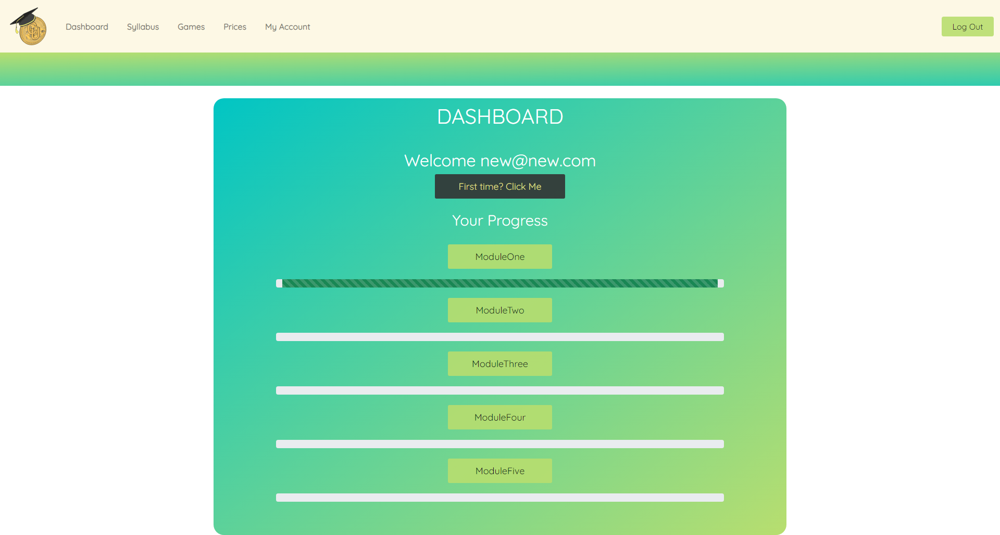
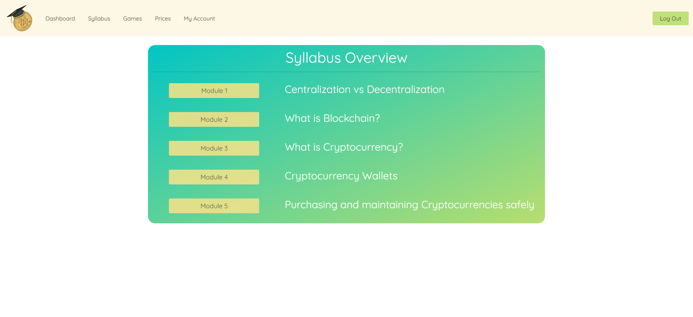
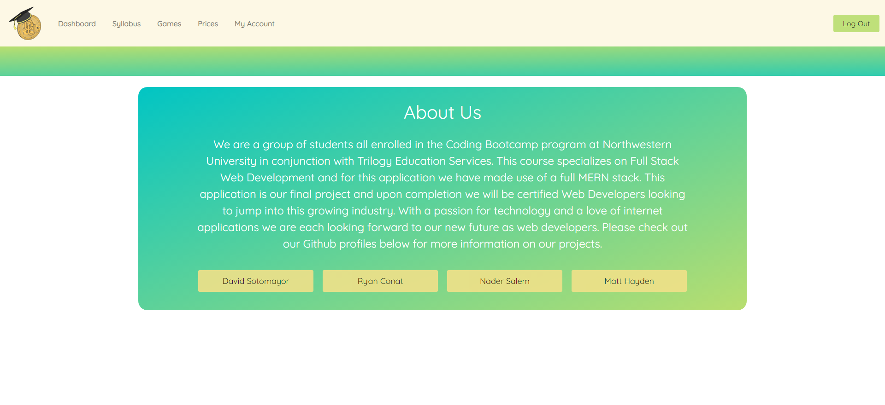

# Crypto University

## Description

The purpose of this project was to create a full stack MERN application. The project must be hosted through Heroku.

To fulfill these requirements we have a created Crypto University

Crypto University is an application that allows users to educate themselves on cryptocurrencies. We provide educational content that is important to the understanding of cryptocurrencies as well as some basic information on how to safely engage in buying and storing the currencies. We also provide a quick price checker to allow the user to check on the current prices of cryptocurrencies as well. 

You can find the repo on [GitHub](https://github.com/Rconat/crypto-university).

The project is deployed on [Heroku](https://sheltered-garden-64832.herokuapp.com/).

---

---

## Table of Contents

* [MERN Stack](#MERN-Stack)
* [Explanation of Code](#Explanation-of-Code)
    * [Firebase Authentication](#Firebase-Authentication)
    * [Express NPM](#Express-NPM)
    * [JavaScript Libraries](#JavaScript-Libraries)
    * [Bootstrap](#Bootstrap)
    * [React-to-print](#React-to-print)
    * [Usage](#Usage)
* [Credits](#Credits)

---

## MERN stack

[MongoDB](https://www.mongodb.com/)

[Express.js](https://expressjs.com/)

[React.js](https://reactjs.org/)

[Node.js](https://nodejs.org/en/docs/)

---

## Explanation of Code

 

## Firebase Authentication
We implemented googles firebase services for our authntication process in order to create and sign in users to the website. We rely on Firebase for authentication to make use of the benefits they provide users in terms or security as well as server reliability.

Additional Firebase documentation located [here](https://firebase.google.com/).

## Express npm
Express NPM is a Node.js web application framework. This framework is used to help develop Node based web applications. The Express framework allows us to set up middlewares that will respond to HTTP requests. Express also allows us to define our routing modules in both the api-routes.js file as well as the html-routes.js file and then using those requests we can dynamically render HTML pages client side to be used in the application. Express is mainly implemented in the server.js file however it references all of the route modules. Express is the framework that allows our client side to communicate with the server side database. 

Additional Express npm documentation located [here](https://expressjs.com/).

---

## JavaScript Libraries

We have implemented the following JavaScript libraries in this project:

[jQuery](https://jquery.com/)

[Bootstrap](https://getbootstrap.com/docs/4.1/getting-started/introduction)

[Google Fonts](https://fonts.google.com/)

[React-to-print](https://www.npmjs.com/package/react-to-print)

---

## Bootstrap
We made use of Bootstrap library to quickly iterate and come up with a successful user interface that would be easy to navigate and easy to understand. For more information on Bootstrap check out the [Bootstrap documentation](https://getbootstrap.com/docs/4.1/getting-started/introduction).

## Google Fonts
We made use of the 'Quicksand' font with the sans-serif style throughout this project. This font gave us a clean legibility and a nice style to compliment the sleek design of out applicaiton.

## React-to-print
We have mande use of the React-to-print NPM in this application. The React-to-print npm allows us to print off any components that exist in our application. We have implemented this in the printing off of diploma when the user finishes progressing through all of the modules. For more information on React-to-print check out out the [React-to-print documentation](https://www.npmjs.com/package/react-to-print).

---

## Usage
Users of this applicaiton will create a username and a password used to access the website. The user can then navigate around tha application and learn about cryptocurrencies through our modules as well as games page. Upon completing quizzes after each module the progress for each module will update on the dashboard. Upon completion of every module the user can print off a "diploma" from Crypto University. The user can access the prices page at any time which will give the current prices of the top popular crypto currencies as well as take note of the change in prices from day to day.

---

## Contributors

[Nader Salem](https://github.com/n1flight)

[David E. Sotomayor](https://github.com/DavidESotomayor)

[Matthew Hayden](https://github.com/matthayden09)

[Ryan Conat](https://github.com/Rconat)

---

## Credits

This project was done under Trilogy Education Services through the Northwestern University Coding Bootcamp. The assignment parameters was provided by Trilody Education Services. We would like to the the TAs for their help through this project and for giving us helpful tips to create this fun application, as well as helping us debug any coding issues along the way of course.

---

## Getting Started with Create React App

This project was bootstrapped with [Create React App](https://github.com/facebook/create-react-app).

## Available Scripts

In the project directory, you can run:

### `npm start`

Runs the app in the development mode.\
Open [http://localhost:3000](http://localhost:3000) to view it in the browser.

The page will reload if you make edits.\
You will also see any lint errors in the console.

### `npm test`

Launches the test runner in the interactive watch mode.\
See the section about [running tests](https://facebook.github.io/create-react-app/docs/running-tests) for more information.

### `npm run build`

Builds the app for production to the `build` folder.\
It correctly bundles React in production mode and optimizes the build for the best performance.

The build is minified and the filenames include the hashes.\
Your app is ready to be deployed!

See the section about [deployment](https://facebook.github.io/create-react-app/docs/deployment) for more information.

### `npm run eject`

**Note: this is a one-way operation. Once you `eject`, you can’t go back!**

If you aren’t satisfied with the build tool and configuration choices, you can `eject` at any time. This command will remove the single build dependency from your project.

Instead, it will copy all the configuration files and the transitive dependencies (webpack, Babel, ESLint, etc) right into your project so you have full control over them. All of the commands except `eject` will still work, but they will point to the copied scripts so you can tweak them. At this point you’re on your own.

You don’t have to ever use `eject`. The curated feature set is suitable for small and middle deployments, and you shouldn’t feel obligated to use this feature. However we understand that this tool wouldn’t be useful if you couldn’t customize it when you are ready for it.

## Learn More

You can learn more in the [Create React App documentation](https://facebook.github.io/create-react-app/docs/getting-started).

To learn React, check out the [React documentation](https://reactjs.org/).

### Code Splitting

This section has moved here: [https://facebook.github.io/create-react-app/docs/code-splitting](https://facebook.github.io/create-react-app/docs/code-splitting)

### Analyzing the Bundle Size

This section has moved here: [https://facebook.github.io/create-react-app/docs/analyzing-the-bundle-size](https://facebook.github.io/create-react-app/docs/analyzing-the-bundle-size)

### Making a Progressive Web App

This section has moved here: [https://facebook.github.io/create-react-app/docs/making-a-progressive-web-app](https://facebook.github.io/create-react-app/docs/making-a-progressive-web-app)

### Advanced Configuration

This section has moved here: [https://facebook.github.io/create-react-app/docs/advanced-configuration](https://facebook.github.io/create-react-app/docs/advanced-configuration)

### Deployment

This section has moved here: [https://facebook.github.io/create-react-app/docs/deployment](https://facebook.github.io/create-react-app/docs/deployment)

### `npm run build` fails to minify

This section has moved here: [https://facebook.github.io/create-react-app/docs/troubleshooting#npm-run-build-fails-to-minify](https://facebook.github.io/create-react-app/docs/troubleshooting#npm-run-build-fails-to-minify)
